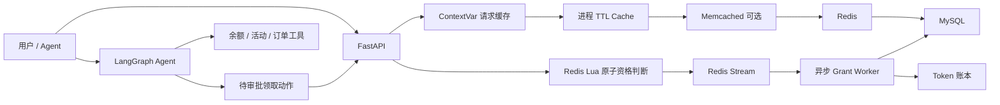

# TokenSeckill · 限量 Token 套餐高并发秒杀平台

这是一个从 `hm-dianping` 秒杀思路重构而来的 Python 项目。它保留了限量 Token 包发放的高并发核心，又加入了真正可演示的 AI Agent 能力：工具调用、跨轮记忆和高风险动作人工确认。

> 当前版本不声称拥有未经压测的 QPS/P99 数据。简历中的技术结论均可由代码、自动化测试或运行日志解释。

## 项目解决什么问题

- 活动开始瞬间，大量用户同时领取限量 Token 包。
- Redis Lua 在一个原子操作里完成活动时间校验、库存校验、一人一单、预扣库存、写入 Stream、写入延时取消队列并广播实时库存。
- Redis Stream 消费者异步完成 MySQL 条件扣减、订单落库、Token 账本和余额更新。
- 订单 ID、数据库唯一约束和账本唯一流水共同保证重复消费幂等。
- 拿到资格但迟迟未发放的订单，会被延时取消任务自动释放，避免库存被永久扣掉。
- 入口叠加用户/IP/活动三级滑动窗口限流与可选的行为验证码，拦截面刷机流量。
- 库存变化通过 SSE 实时推送给前端，供活动前倒计时与开始后实时递减展示。
- Agent 可以查询余额、活动和订单，也可以生成待确认的领取动作；真正抢购必须经过独立审批接口。

## 架构



更完整的设计与 Java 到 Python 映射见 [docs/ARCHITECTURE.md](docs/ARCHITECTURE.md)。

## 技术栈

- Python 3.12+、FastAPI、Pydantic
- SQLAlchemy 2.0 Async、MySQL 8
- redis-py asyncio、Redis Lua、Redis Stream consumer group
- ContextVar、cachetools、可选 Memcached
- LangGraph、OpenAI-compatible chat model
- pytest、fakeredis、Docker Compose

## 快速启动

### 方式一：Docker Compose

```powershell
Copy-Item .env.example .env
docker compose up --build -d
docker compose exec api python scripts/seed_demo.py
```

打开 `http://localhost:8012/docs` 查看并调用接口。后台 worker 会自动消费 Stream。

### 方式二：本地 Python + Docker 中间件

```powershell
Copy-Item .env.example .env
docker compose up -d mysql redis memcached
py -3.12 -m venv .venv
.\.venv\Scripts\python -m pip install -e ".[dev]"
# 本地进程连接容器时，将 .env 的主机改为 localhost，Redis 端口改为 6380
.\.venv\Scripts\python scripts\seed_demo.py
.\.venv\Scripts\uvicorn token_seckill.main:app --reload
```

另开一个终端启动发放消费者：

```powershell
.\.venv\Scripts\python -m token_seckill.workers.grant_consumer
```

## 最短演示路径

1. 使用种子脚本输出的 `user_id` 和 `activity_id`。
2. 请求 `POST /api/v1/activities/{activity_id}/claim`，Header 带 `X-User-Id`。
3. 用响应中的 `order_id` 请求 `GET /api/v1/orders/{order_id}`。
4. Worker 消费完成后，状态从 `processing` 变为 `success`，用户余额与 Token 账本同时更新。

Agent 演示还需在 `.env` 设置：

```text
LLM_API_KEY=your-key
LLM_MODEL=your-tool-calling-model
# 使用兼容服务时再设置 LLM_BASE_URL
```

随后调用 `POST /api/v1/agent/invoke`。当 Agent 返回 `action_id` 后，用户必须调用 `POST /api/v1/agent/actions/{action_id}/approve` 才会真正执行抢购。

## 验证

```powershell
.\.venv\Scripts\ruff check .
.\.venv\Scripts\pytest -q
```

测试重点覆盖：一人一单、库存不为负数、非活动期不扣库存、Stream 重复投递只落一次、延时取消（过期释放/已发放跳过）、三级限流、一次性验证码与实时库存广播。

## 项目边界

- 当前使用 Redis 单实例语义。Lua 同时访问库存、用户集合、订单状态、全局 Stream、延时 ZSET 与库存频道；若迁移 Redis Cluster，需要统一 hash tag、按活动分 Stream，或将事件队列替换为 Kafka。
- `X-User-Id` 是便于面试演示的身份注入方式，不是生产认证方案；限流在应用层实现，仍可再由网关叠加。
- SSE 库存推送与三级限流的行为验证码属于可演示工程，万级连接与压测指标未实测，不在文档中声称。
- 数据库表在 demo 启动时自动创建；正式部署应接入 Alembic 迁移和密钥管理。
- Memcached 是为了复现参考架构而保留的可选层。多数中小规模部署使用“请求缓存 + 本地缓存 + Redis + MySQL”已经足够。

## 简历与面试材料

- [简历项目描述](docs/RESUME.md)
- [架构与关键决策](docs/ARCHITECTURE.md)
- [面试讲解提纲](docs/INTERVIEW.md)
